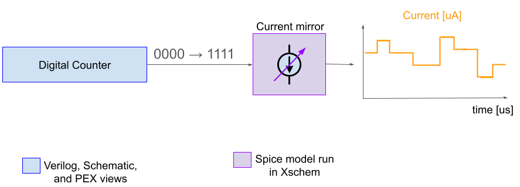
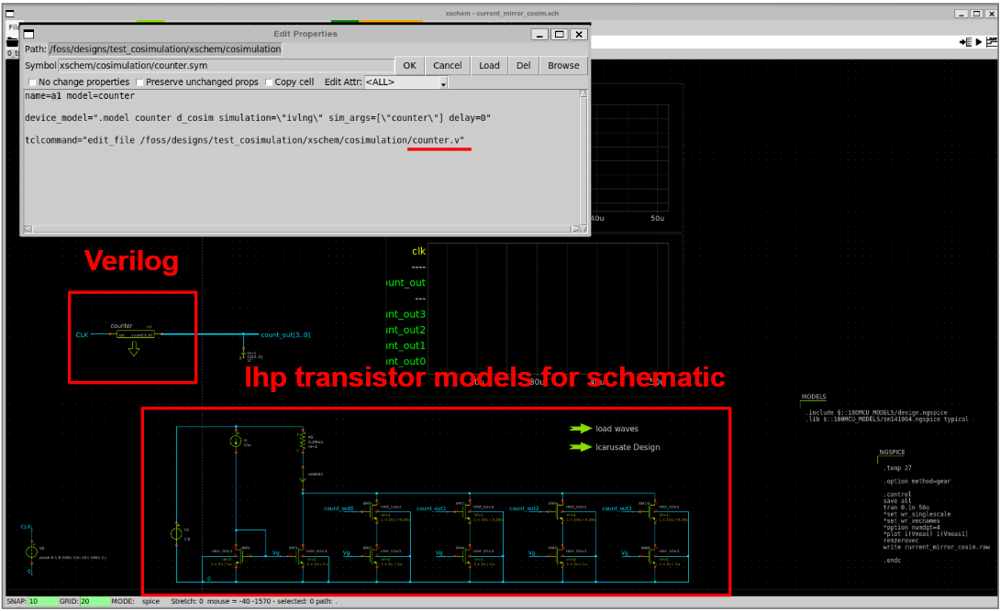
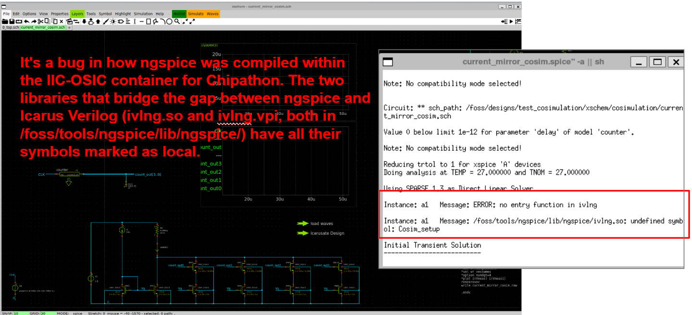

# Cosimulation tutorial for Mixed-Signal simulations

This tutorial presents different views of a digital cell for running a co-simulation with an analog cell using gf180mcuD technology.

The goal is to perform a co-simulation between a 4-bit counter and the Verilog, Schematic, and PEX views with a current mirror that includes gf180mcu transistors. The current mirror is a schematic view.

The block diagram of the co-simulation system is presented below.

   

  

## Compiling and validating the Verilog code.

All the material associated with this part of the flow is in the [`schematic_view/`](schematic_view/) folder.

## Verilog view

Follows the block diagram of the circuit that instantiates a Verilog view into a symbol and the schematic of a current mirror.

   

 
 
When associating the Verilog code  to a symbol in Xschem, and after copiling the code for running the simulation with gf180mcu transistors, an error appears because the ngspice was compiled within the IIC-OSIC container for Chipathon. The two libraries that bridge the gap between ngspice and Icarus Verilog (ivlng.so and ivlng.vpi, both in /foss/tools/ngspice/lib/ngspice/) have all their symbols marked as local and should be as global.

   

 

We are working to solve this issue in the Docker container. We will keep you posted when this issue will be solved.

> 🚧 \*\*Under Construction\*\*

## Schematic view

## PEX view

